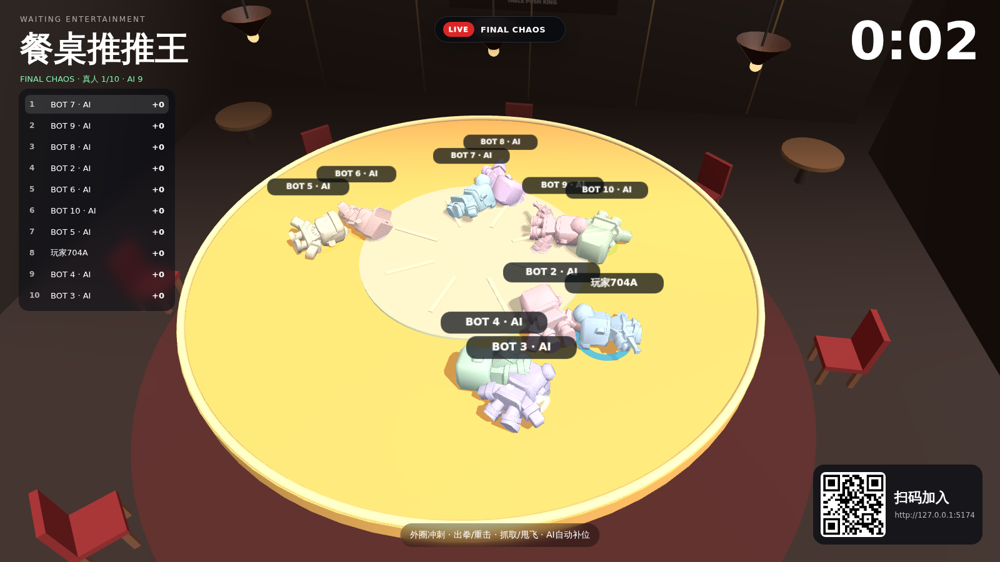
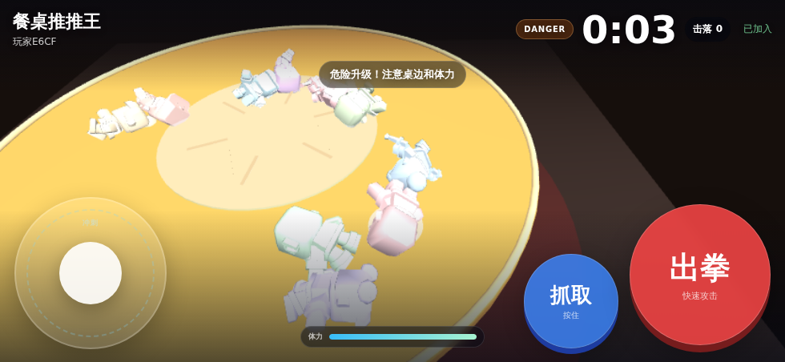
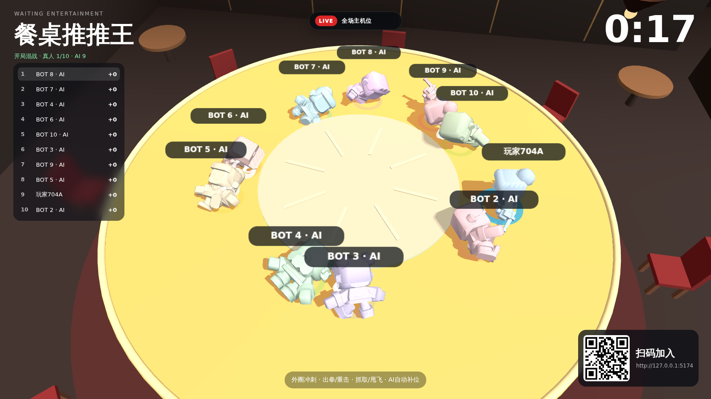

# Waiting Entertainment Prototype

Waiting Entertainment is a browser-based public multiplayer game system for restaurant waiting areas.

The first game is **餐桌推推王 / Table Push King**: guests scan a QR code, use their phones as controllers, and fight on a shared big screen in a short physics match.

## Current MVP

Implemented:

- 10 persistent player slots
- 1-10 human players with automatic AI fill
- Single local GameSession with server-authoritative Rapier3D physics
- 60Hz host physics / 20Hz state snapshots
- Three.js big-screen renderer
- Phone personal 3D gameplay view + camera-relative joystick + Attack/Grab combat controls
- Human disconnect -> immediate AI takeover
- Phone refresh / wake / reconnect -> reclaim the same character
- Expanded circular table arena with run-up space
- Authoritative rotating center lazy Susan that ramps through the round
- Sprint + authoritative Stamina + Punch / Sprint Heavy Strike
- Persistent Grab / Carry / manual directional Throw with stamina drain
- Simplified ledge catch and climb-back
- Pre-Final falls respawn after a short delay; Final Chaos uses permanent elimination
- 3-second round countdown
- ~180-second staged brawls: Opening / Brawl / Danger / Final Chaos
- Elimination scoring and live ranking
- Automatic winner selection and round restart
- QR join flow
- Player names on the big screen
- TV-style automatic broadcast director with master/action/edge/duel/winner shots
- Highlight selection across tosses, saves and eliminations
- Multi-angle 0.45x replay package for decisive moments
- Replaceable local CC0 low-poly GLB character variants; original IP pack is archived separately
- Centralized authoritative game-feel tuning config
- Symptom-driven tuning guide for real-device feedback
- Local physics tuning sandbox
- CI build, server runtime smoke test, and Socket end-to-end test

## Technology

- Three.js
- Rapier3D
- TypeScript
- Node.js
- Socket.IO
- Vite

## Run

Requirements: Node.js 22+, npm 10+, and phones on the same LAN as the host computer.

```bash
npm install
npm run dev
```

Open the big screen using the host computer's LAN address, for example:

```text
http://192.168.1.20:5173
```

Do **not** use `localhost` on the restaurant big screen if phones need to scan the QR code. The QR code points phones to port `5174` on the same host.

Services:

- Big screen: `:5173`
- Mobile controller: `:5174`
- Authoritative game server: `:3001`
- Health check: `:3001/health`

For the keyboard-only physics sandbox:

```text
http://localhost:5173/?mode=local
```

Controls: WASD / arrows to move, Shift to sprint, Space to attack, R to restart.

## Product principle

This is not a traditional mobile game and not a SaaS-first product.

Priority order:

1. Game feel
2. Big-screen spectacle
3. Three-second learnability
4. Multiplayer stability
5. Personal phone-screen experience
6. AI fill
7. Fast creation of additional games
8. Commercial management systems

See `docs/CORE_RECOMMENDATIONS.md` for the long-term product direction, `docs/PARTY_ANIMALS_PARITY_MATRIX.md` for the combat parity target, `docs/PHYSICS_PARTY_DIRECTION.md` for the gameplay roadmap, and `docs/BROADCAST_DIRECTOR.md` for the TV-style camera/replay system, plus `docs/RUNNING.md`, `docs/ARCHITECTURE.md`, `docs/TUNING.md`, and `docs/ROADMAP.md`.


## Topology boundary

The current product is intentionally **single restaurant / single host / single live game session**.

There is no matchmaking, public room browser, multi-room orchestration, or cloud-authoritative gameplay in the MVP. The phone is a personal game/control screen connected to the restaurant host over LAN.


## Visual Preview

Current automated screenshots from the actual running build:

### Big screen



### Phone player view



### TV-style replay



These images are captured from the real Three.js/Socket.IO build rather than mockups. Refresh them through the `Visual Preview` GitHub Action after meaningful visual changes.
